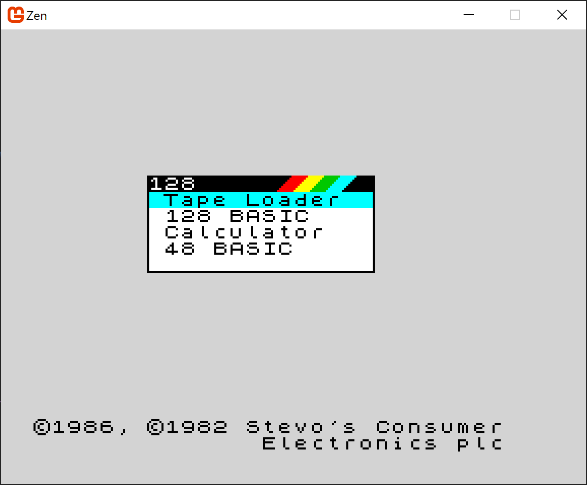
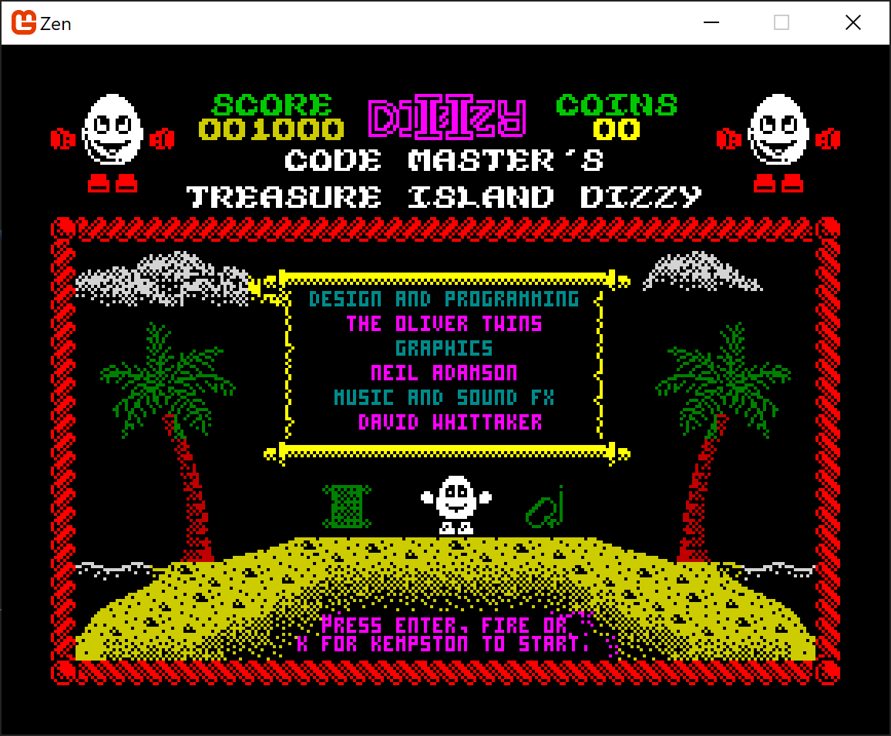

# Zen

A Z80/ZX Spectrum emulator. This is an evolution of my previous project <a href="https://github.com/stevehjohn/ZXE">ZXE</a>.

While ZXE was certainly "good enough" (it runs most games I've tried, and emulates the main Spectrum model lineup), some architectural
decisions were starting to make it hard to maintain and extend. Also, it didn't deal with nuances such as contention and accurate timing
for display output.

This project aims to take the lessons learned from ZXE and build upon them.

## Solution Structure

### Zen.Desktop.Host

The fun bit most people are probably interested in. This is the UI that you can run to emulate a Speccy.

Compatible with Windows and macOS (and in theory, Linux, but I haven't tested that).

Press <kbd>F10</kbd> for the menu once running.

Open `Zen.Desktop.Host.sln` and build it with your favourite tool(s).

I did have one issue building on macOS on an M1 processor. Solved by https://stackoverflow.com/a/74317078.

- `brew install freeimage`
- `sudo ln -s /opt/homebrew/Cellar/freeimage/3.18.0/lib/libfreeimage.dylib /usr/local/lib/libfreeimage`
