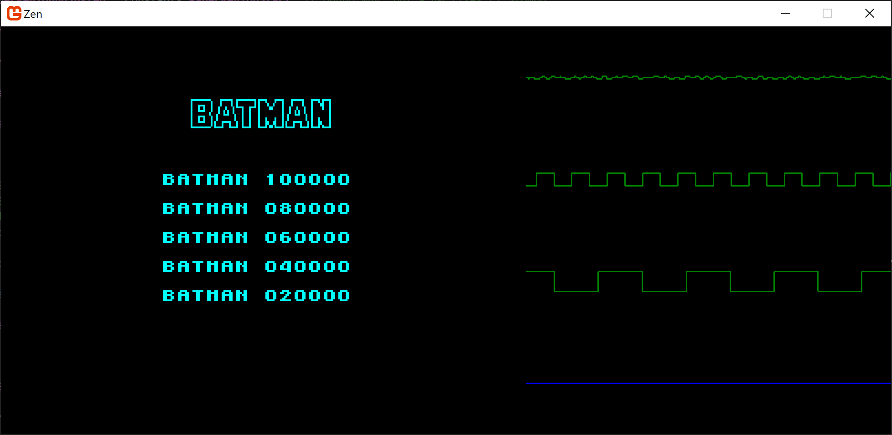
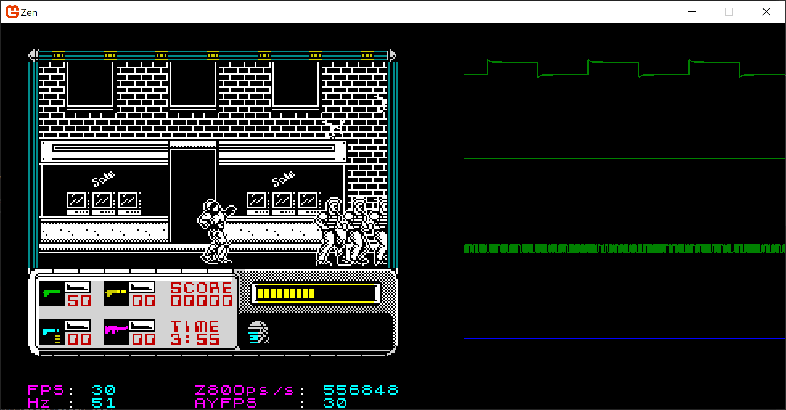
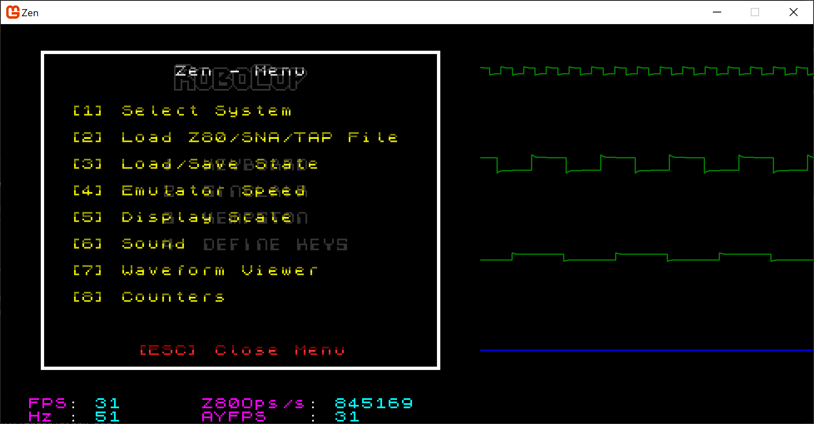

# Zen

A Z80/ZX Spectrum emulator. This is an evolution of my previous project <a href="https://github.com/stevehjohn/ZXE">ZXE</a>.

The Z80 is properly decoupled from the Spectrum emulation, so can be reused in other projects requiring Z80 emulation.

See screenshots <a href="#screenshots">below</a>.

While ZXE was certainly "good enough" (it runs most games I've tried, and emulates the main Spectrum model lineup), some architectural
decisions were starting to make it hard to maintain and extend. Also, it didn't deal with nuances such as contention and accurate timing
for display output.

This project aims to take the lessons learned from ZXE and build upon them.

Any feedback appreciated, get me on <a href="https://x.com/SteveHuwJohn">Twitter / X</a>

## Pre-built Binaries

Releases can be found <a href="https://github.com/stevehjohn/Zen/releases">here</a>.

The pre-built Linux binaries are experimental, i.e <a href="https://en.wiktionary.org/wiki/your_mileage_may_vary">YMMV</a>. Probably better off building it from source.

Press <kbd>Tab</kbd> for the menu once running.

For macOS and Linux, extract the files somewhere and execute with `./Zen.Desktop.Host`.

For Windows, extract the files somewhere and run `Zen.Desktop.Host.exe`.

## Solution Structure

### Zen.Desktop.Host

The fun bit most people are probably interested in. This is the UI that you can run to emulate a Speccy.

Compatible with Windows and macOS (and in theory, Linux, but I haven't tested that).

Press <kbd>Tab</kbd> for the menu once running.

Open `Zen.Desktop.Host.sln` and build it with your favourite tool(s).

I did have one issue building on macOS on an M1 processor. Solved by https://stackoverflow.com/a/74317078.
You may or may not need to do the second step. On my M1 MacBook, I didn't need to, but on my new M3 MacBook, I did.

- `brew install freeimage`
- `mkdir /usr/local/lib`
- `sudo ln -s /opt/homebrew/Cellar/freeimage/3.18.0/lib/libfreeimage.dylib /usr/local/lib/libfreeimage`

### Zen.Z80

This is the core of the processor that can be used to emulate anything that uses a Z80 (in theory).

### Zen.System

This emulates the Spectrum motherboard and can be used as an example of how to integrate with the Zen.Z80 project.

## Useful Resources

A JSON definition of the instruction metadata can be found <a href="https://github.com/stevehjohn/Zen/blob/master/Documentation/Instructions.json">here</a>.

A table of supported opcodes can be found <a href="https://stevehjohn.github.io/Zen/SupportedOpCodes.html">here</a>. Click on the opcode to see the source code of the implementation.

<a id="Screenshots" />

## Screenshots

